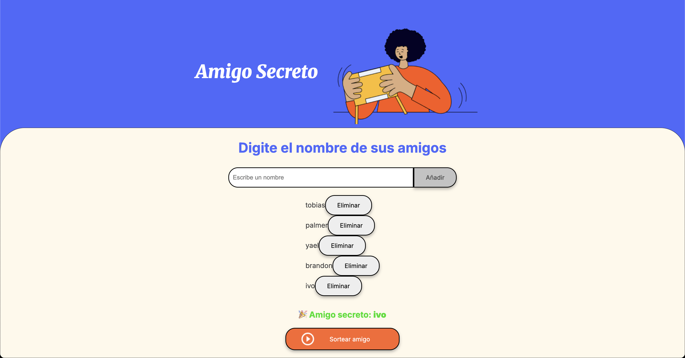

#Challenge – Amigo Secreto

Aplicación web creada como parte del **Challenge "Amigo Secreto"** de **Alura LATAM** y el programa **Oracle Next Education (ONE)**.  
Permite agregar amigos a una lista, validando nombres y evitando duplicados, para luego sortear un amigo secreto de forma aleatoria.

---

#Screen web funcionando

> Vista de la aplicación con lista de participantes y resultado del sorteo.

---

## 🎯 Objetivo del desafío

- Practicar lógica de programación con **JavaScript**.
- Capturar datos desde un input y manipular el **DOM**.
- Validar entradas (evitar nombres vacíos o repetidos).
- Mostrar dinámicamente los nombres en pantalla.
- Realizar un sorteo aleatorio usando `Math.random()` y mostrar el resultado.

---

## 🚀 Funcionalidades

- **Agregar nombres** a la lista con un botón o presionando *Enter*.
- **Validación en vivo:** no permite campos vacíos ni nombres duplicados.
- **Eliminar participantes** individualmente.
- **Sorteo aleatorio** con resultado visible en pantalla.
- **Reinicio automático** del resultado al modificar la lista.

---

## 🛠️ Tecnologías

- **HTML5** – estructura semántica  
- **CSS** – estilos y diseño responsivo  
- **JavaScript** – lógica de negocio y manipulación del DOM  

---

## Estructura del proyecto
Challenge-amigo-secreto-alura/
├── assets/
│   └── Amigo_secreto_demo.png  # Captura usada en el README
├── index.html
├── style.css
└── app.js

## Lógica del sorteo
	•	Los nombres se guardan en un array amigos.
	•	Antes de sortear, se valida que el array no esté vacío.
	•	Se usa Math.floor(Math.random() * amigos.length) para elegir un índice aleatorio.
	•	El nombre seleccionado se muestra en un <li> dentro de la lista de resultados.

## Thomas Arce
GitHub: @thomasarcee
